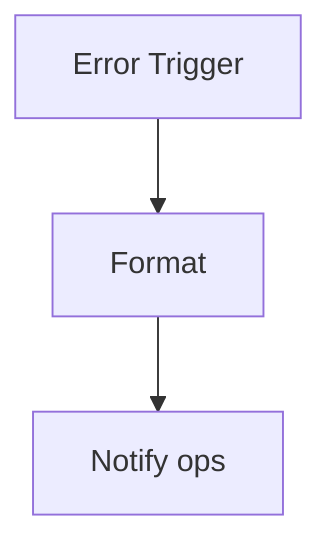

<!-- GENERATED by grace_platform.docs.gen_workflows — DO NOT EDIT.
     Source of truth: platform/n8n/workflows/*.json
     Regenerate with: make docs -->

# WF-00 Global Error Handler

**Status:** **Active.** Fires whenever any other workflow errors.
**Source:** `platform/n8n/workflows/WF-00-global-error-handler.json`
**Error handler:** `—`

## Flow

## Nodes, in order

| # | Node | Kind | What it does | Credential |
|---|---|---|---|---|
| 1 | **Error Trigger** | Error trigger | Fires when any workflow listing this one as its error handler fails. | — |
| 2 | **Format** | Code | Never echo the failing payload: it may contain caller utterances, and this | — |
| 3 | **Notify ops** | HTTP request | `POST` to `$GRACE_CORE_API_URL/internal/notify/ops`, timeout 10000 ms. | `__CRED__:core-api` |

## Where to see it

n8n → **Workflows** → `[dev] WF-00 Global Error Handler` (`TskMxWsdNPdtyzwz`).
Tagged `managed:git` and `env:dev`, which is how the deploy script knows it owns it — anything
untagged is invisible to it.

Runs appear under **Executions**.
