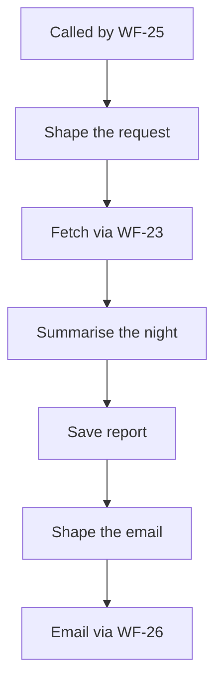

<!-- GENERATED by grace_platform.docs.gen_workflows — DO NOT EDIT.
     Source of truth: platform/n8n/workflows/*.json
     Regenerate with: make docs -->

# WF-07 Nightly Reconciliation Report

**Status:** **Deployed, waiting on integration.** Invoked nightly by WF-25 — it has no schedule of its own any more — and records a row either way, but reports "Core API unreachable" until that service exists. The email step is present and disabled, pending the client's email account.
**Source:** `platform/n8n/workflows/WF-07-nightly-reconciliation.json`
**Error handler:** `__WF__:wf-00`
**Calls:** WF-23, WF-26
**Called by:** WF-25

## What it does, and when it runs

Checks overnight that our records and the booking system's records still agree, and writes down what it found. It reports rather than repairs: nothing here changes a booking. Runs at 03:15 so it trails the reconciliation job that finishes by 03:00 — that ordering is a real dependency, not a preference.

## Flow

## Nodes, in order

| # | Node | Kind | What it does | Credential |
|---|---|---|---|---|
| 1 | **Called by WF-25** | Called by another workflow | Entry point when another workflow calls this one (`passthrough`). | — |
| 2 | **Shape the request** | Code | The one line that differs between reports: which Core API report to ask for. | — |
| 3 | **Fetch via WF-23** | Calls another workflow | Invokes workflow `__WF__:wf-23`. | — |
| 4 | **Summarise the night** | Code | Map the normalised fetch (WF-23) onto this report's own columns. Core API does | — |
| 5 | **Save report** | Data Table | Writes a row to the `reconciliation_reports` data table, 5 columns. | — |
| 6 | **Shape the email** | Code | Shape the email sent via WF-26 — the report's own summary is the whole body. | — |
| 7 | **Email via WF-26** | Calls another workflow | Invokes workflow `__WF__:wf-26`. | — |

## Where to see it

n8n → **Workflows** → `[dev] WF-07 Nightly Reconciliation Report` (`CaqwD6oqREcr2mza`).
Tagged `managed:git` and `env:dev`, which is how the deploy script knows it owns it — anything
untagged is invisible to it.

Runs appear under **Executions**.
