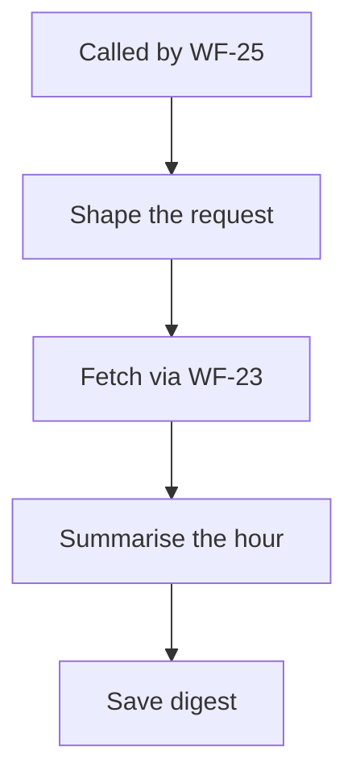

<!-- GENERATED by grace_platform.docs.gen_workflows — DO NOT EDIT.
     Source of truth: platform/n8n/workflows/*.json
     Regenerate with: make docs -->

# WF-11 Hourly Call Digest

**Status:** **Deployed, waiting on integration.** Invoked hourly by WF-25 and records a row either way. Reports "Core API unreachable" until that service exists.
**Source:** `platform/n8n/workflows/WF-11-hourly-call-digest.json`
**Error handler:** `__WF__:wf-00`
**Calls:** WF-23
**Called by:** WF-25

## What it does, and when it runs

Tells staff what happened in the last hour — calls taken, bookings made, tasks still open. This is the *normal activity* report; its counterpart WF-22 reports faults. It reads from Core API rather than from Vapi because bookings and staff tasks are things Vapi has no knowledge of.

## Flow

## Nodes, in order

| # | Node | Kind | What it does | Credential |
|---|---|---|---|---|
| 1 | **Called by WF-25** | Called by another workflow | Entry point when another workflow calls this one (`passthrough`). | — |
| 2 | **Shape the request** | Code | The one line that differs between reports: which Core API report to ask for. | — |
| 3 | **Fetch via WF-23** | Calls another workflow | Invokes workflow `__WF__:wf-23`. | — |
| 4 | **Summarise the hour** | Code | Staff-facing digest of the last hour, mapped from the normalised fetch (WF-23). | — |
| 5 | **Save digest** | Data Table | Writes a row to the `call_digests` data table, 6 columns. | — |

## Where to see it

n8n → **Workflows** → `[dev] WF-11 Hourly Call Digest` (`rOz6zbgZzWIBY9Fv`).
Tagged `managed:git` and `env:dev`, which is how the deploy script knows it owns it — anything
untagged is invisible to it.

Runs appear under **Executions**.
