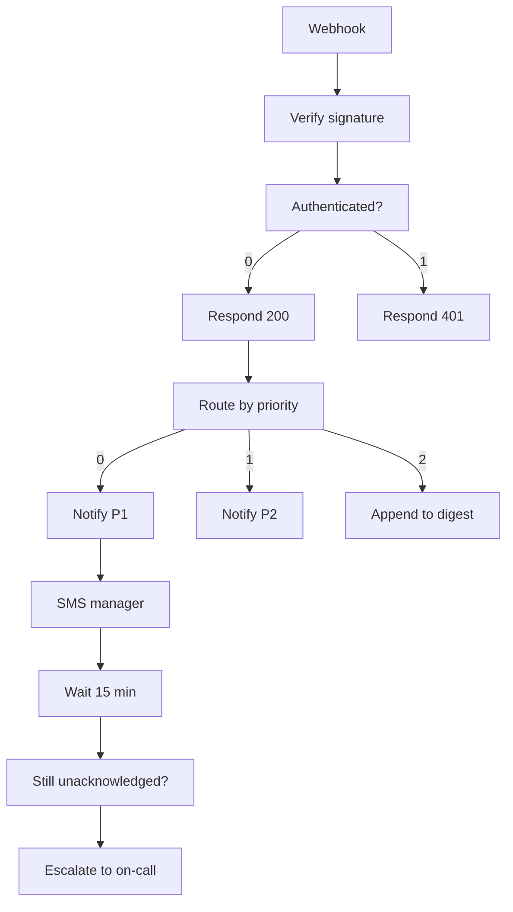

<!-- GENERATED by grace_platform.docs.gen_workflows — DO NOT EDIT.
     Source of truth: platform/n8n/workflows/*.json
     Regenerate with: make docs -->

# WF-12 Escalation & Alerting

**Status:** **Published but dormant.** Nothing triggers it yet — the signed webhook that would comes from Core API, which is not built. Correct scaffolding, currently inert.
**Source:** `platform/n8n/workflows/WF-12-escalation-alerting.json`
**Error handler:** `__WF__:wf-00`

## Flow

## Nodes, in order

| # | Node | Kind | What it does | Credential |
|---|---|---|---|---|
| 1 | **Webhook** | Webhook trigger | Receives `POST /{{ENV}}/escalation`. Raw Body on. | — |
| 2 | **Verify signature** | Code | HMAC per doc 09 §2.1. The signature covers the exact bytes, so Raw Body must be on. | — |
| 3 | **Authenticated?** | Branch (if) | Splits into a true branch and a false branch. | — |
| 4 | **Respond 200** | Respond to webhook | Replies HTTP 200 and ends the request. | — |
| 5 | **Respond 401** | Respond to webhook | Replies HTTP 401 and ends the request. | — |
| 6 | **Route by priority** | Branch (switch) | Routes to: `P1`, `P2`, `P3`. | — |
| 7 | **Notify P1** | HTTP request | `POST` to `$GRACE_CORE_API_URL/internal/notify/staff`, timeout 10000 ms. | `__CRED__:core-api` |
| 8 | **SMS manager** | HTTP request | `POST` to `$GRACE_CORE_API_URL/internal/notify/sms`, timeout 10000 ms. | `__CRED__:core-api` |
| 9 | **Wait 15 min** | Wait | Pauses 15 minutes. Over 65s, so the execution is written to the database and survives a restart. | — |
| 10 | **Still unacknowledged?** | HTTP request | `GET` to `$GRACE_CORE_API_URL/internal/tasks/{{ $json.taskId }}`, timeout 10000 ms. | `__CRED__:core-api` |
| 11 | **Escalate to on-call** | Calls another workflow | Invokes workflow `__WF__:wf-18`. | — |
| 12 | **Notify P2** | HTTP request | `POST` to `$GRACE_CORE_API_URL/internal/notify/staff`, timeout 10000 ms. | `__CRED__:core-api` |
| 13 | **Append to digest** | HTTP request | `POST` to `$GRACE_CORE_API_URL/internal/digest/append`, timeout 10000 ms. | `__CRED__:core-api` |

## Where to see it

n8n → **Workflows** → `[dev] WF-12 Escalation & Alerting` (`Nig7UzGSTwVZuFLg`).
Tagged `managed:git` and `env:dev`, which is how the deploy script knows it owns it — anything
untagged is invisible to it.

Runs appear under **Executions**.
