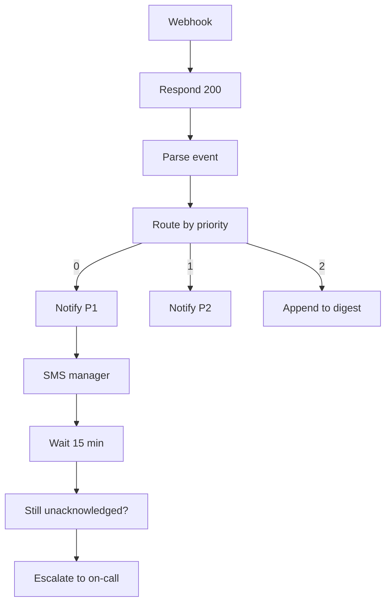

<!-- GENERATED by grace_platform.docs.gen_workflows — DO NOT EDIT.
     Source of truth: platform/n8n/workflows/*.json
     Regenerate with: make docs -->

# WF-12 Escalation & Alerting

**Status:** **Published, active, and dormant.** Its webhook uses n8n's native Header Auth (Q-04.5, resolved) against the `n8n-inbound` credential, which now exists — it deployed cleanly on 2026-08-05. Nothing triggers it yet: the caller is Core API, which is not built.
**Source:** `platform/n8n/workflows/WF-12-escalation-alerting.json`
**Error handler:** `__WF__:wf-00`
**Calls:** WF-18

## What it does, and when it runs

The front door for anything urgent. When something needs a human, the system posts here and this workflow decides who hears about it and how loudly: a P1 pages the manager by text and starts a 15-minute timer, a P2 notifies without the alarm, and anything lower is filed into a digest. It answers the caller immediately and does the work afterwards, so nothing waits on a notification being delivered.

## Flow

## Nodes, in order

| # | Node | Kind | What it does | Credential |
|---|---|---|---|---|
| 1 | **Webhook** | Webhook trigger | Receives `POST /{{ENV}}/escalation`. Raw Body on. | `__CRED__:n8n-inbound` |
| 2 | **Respond 200** | Respond to webhook | Replies HTTP 200 and ends the request. | — |
| 3 | **Parse event** | Code | Native Header Auth replaced the HMAC-in-a-Code-node check (Q-04.5): n8n verifies | — |
| 4 | **Route by priority** | Branch (switch) | Routes to: `P1`, `P2`, `P3`. | — |
| 5 | **Notify P1** | HTTP request | `POST` to `__URL__:core-api/internal/notify/staff`, timeout 10000 ms. | `__CRED__:core-api` |
| 6 | **SMS manager** | HTTP request | `POST` to `__URL__:core-api/internal/notify/sms`, timeout 10000 ms. | `__CRED__:core-api` |
| 7 | **Wait 15 min** | Wait | Pauses 15 minutes. Over 65s, so the execution is written to the database and survives a restart. | — |
| 8 | **Still unacknowledged?** | HTTP request | `GET` to `__URL__:core-api/internal/tasks/{{ $json.taskId }}`, timeout 10000 ms. | `__CRED__:core-api` |
| 9 | **Escalate to on-call** | Calls another workflow | Invokes workflow `__WF__:wf-18`. | — |
| 10 | **Notify P2** | HTTP request | `POST` to `__URL__:core-api/internal/notify/staff`, timeout 10000 ms. | `__CRED__:core-api` |
| 11 | **Append to digest** | HTTP request | `POST` to `__URL__:core-api/internal/digest/append`, timeout 10000 ms. | `__CRED__:core-api` |

## Where to see it

n8n → **Workflows** → `[dev] WF-12 Escalation & Alerting` (`Nig7UzGSTwVZuFLg`).
Tagged `managed:git` and `env:dev`, which is how the deploy script knows it owns it — anything
untagged is invisible to it.

Runs appear under **Executions**.
