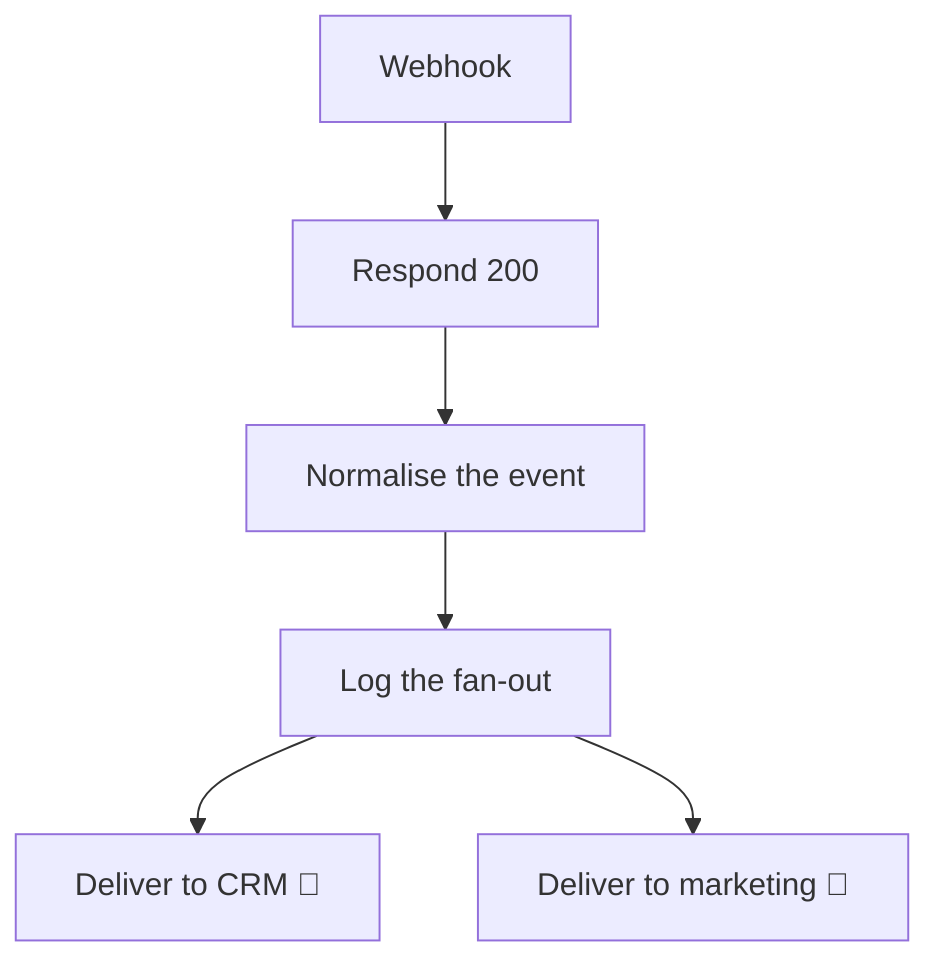

<!-- GENERATED by grace_platform.docs.gen_workflows — DO NOT EDIT.
     Source of truth: platform/n8n/workflows/*.json
     Regenerate with: make docs -->

# WF-17 Vagaro Webhook Fan-out

**Status:** **Deployed, active, waiting on integration.** The `n8n-inbound` credential now exists, so it accepts and acknowledges a signed fan-out event today; the two consumer deliveries are present and disabled until the client names their CRM and marketing endpoints.
**Source:** `platform/n8n/workflows/WF-17-vagaro-webhook-fanout.json`
**Error handler:** `__WF__:wf-00`

## What it does, and when it runs

Passes booking-system changes on to whatever other systems the client wants to keep in step — a CRM, a marketing list. It acknowledges the sender first and forwards afterwards, so a slow or broken consumer can never hold up the booking system that sent it. It deliberately forwards only an event type and an identifier, never caller details.

## Flow

## Nodes, in order

| # | Node | Kind | What it does | Credential |
|---|---|---|---|---|
| 1 | **Webhook** | Webhook trigger | Receives `POST /{{ENV}}/fanout`. Raw Body on. | `__CRED__:n8n-inbound` |
| 2 | **Respond 200** | Respond to webhook | Replies HTTP 200 and ends the request. | — |
| 3 | **Normalise the event** | Code | Fan a Vagaro change out to secondary consumers (client CRM, marketing). | — |
| 4 | **Log the fan-out** | Data Table | Writes a row to the `fanout_log` data table, 5 columns. | — |
| 5 | **Deliver to CRM** *(disabled)* | HTTP request | `POST` to `__URL__:crm/events`, timeout 10000 ms. | — |
| 6 | **Deliver to marketing** *(disabled)* | HTTP request | `POST` to `__URL__:marketing/events`, timeout 10000 ms. | — |

## Where to see it

n8n → **Workflows** → `[dev] WF-17 Vagaro Webhook Fan-out` (`XNrOQHCRUOxffQG7`).
Tagged `managed:git` and `env:dev`, which is how the deploy script knows it owns it — anything
untagged is invisible to it.

Runs appear under **Executions**.
