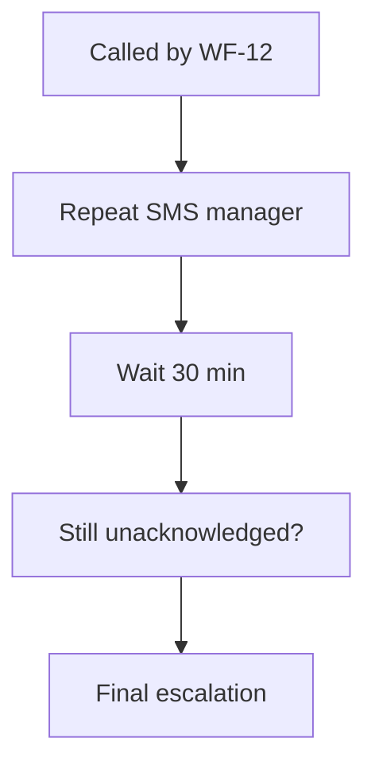

<!-- GENERATED by grace_platform.docs.gen_workflows — DO NOT EDIT.
     Source of truth: platform/n8n/workflows/*.json
     Regenerate with: make docs -->

# WF-18 On-call Escalation

**Status:** **Published but dormant.** Called only by WF-12, which is itself dormant. It also stops short of placing a voice call — that needs Phase F (A-20).
**Source:** `platform/n8n/workflows/WF-18-oncall-escalation.json`
**Error handler:** `__WF__:wf-00`
**Called by:** WF-12

## What it does, and when it runs

The second stage of an urgent alert, for when the first one went unanswered. WF-12 calls it after 15 minutes of silence; it repeats the text message, waits another 30 minutes, and escalates again if still unacknowledged. It has no trigger of its own — it cannot fire unless the escalation path genuinely reached this point.

## Flow

## Nodes, in order

| # | Node | Kind | What it does | Credential |
|---|---|---|---|---|
| 1 | **Called by WF-12** | Called by another workflow | Entry point when another workflow calls this one (`passthrough`). | — |
| 2 | **Repeat SMS manager** | HTTP request | `POST` to `__URL__:core-api/internal/notify/sms`, timeout 10000 ms. | `__CRED__:core-api` |
| 3 | **Wait 30 min** | Wait | Pauses 30 minutes. Over 65s, so the execution is written to the database and survives a restart. | — |
| 4 | **Still unacknowledged?** | HTTP request | `GET` to `__URL__:core-api/internal/tasks/{{ $json.taskId }}`, timeout 10000 ms. | `__CRED__:core-api` |
| 5 | **Final escalation** | HTTP request | `POST` to `__URL__:core-api/internal/notify/staff`, timeout 10000 ms. | `__CRED__:core-api` |

## Where to see it

n8n → **Workflows** → `[dev] WF-18 On-call Escalation` (`IvXEhYoHdxT3e7oA`).
Tagged `managed:git` and `env:dev`, which is how the deploy script knows it owns it — anything
untagged is invisible to it.

Runs appear under **Executions**.
