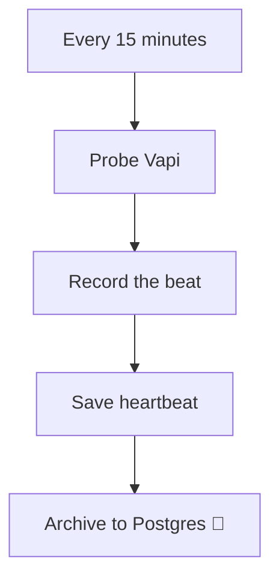

<!-- GENERATED by grace_platform.docs.gen_workflows — DO NOT EDIT.
     Source of truth: platform/n8n/workflows/*.json
     Regenerate with: make docs -->

# WF-19 Platform Heartbeat

**Status:** **Active.** Beats every 15 minutes against Vapi's call API. Works today. Cannot alert while n8n is itself down — see the limit noted in the Code node.
**Source:** `platform/n8n/workflows/WF-19-platform-heartbeat.json`
**Error handler:** `__WF__:wf-00`

## What it does, and when it runs

Proves the system is still alive. Every 15 minutes it records a heartbeat and checks that Vapi still answers and still accepts our key. Because n8n sits off the call path, an outage here would otherwise be invisible until someone noticed reports had stopped. It is deliberately kept separate from every other workflow: a watchdog that shares an on/off switch with the thing it watches is not a watchdog.

## Flow

## Nodes, in order

| # | Node | Kind | What it does | Credential |
|---|---|---|---|---|
| 1 | **Every 15 minutes** | Schedule trigger | Runs on a schedule (America/Chicago). `{"interval": [{"field": "minutes", "minutesInterval": 15}]}` | — |
| 2 | **Probe Vapi** | HTTP request | `GET` to `https://api.vapi.ai/call`, timeout 15000 ms. | `__CRED__:vapi` |
| 3 | **Record the beat** | Code | Write one heartbeat row, and notice if the previous one is missing. | — |
| 4 | **Save heartbeat** | Data Table | Writes a row to the `platform_heartbeat` data table, 5 columns. | — |
| 5 | **Archive to Postgres** *(disabled)* | Postgres | Writes a permanent record to Postgres. | `__CRED__:postgres` |

## Where to see it

n8n → **Workflows** → `[dev] WF-19 Platform Heartbeat` (`cmkpTUzQNe2hgycY`).
Tagged `managed:git` and `env:dev`, which is how the deploy script knows it owns it — anything
untagged is invisible to it.

Runs appear under **Executions**.
