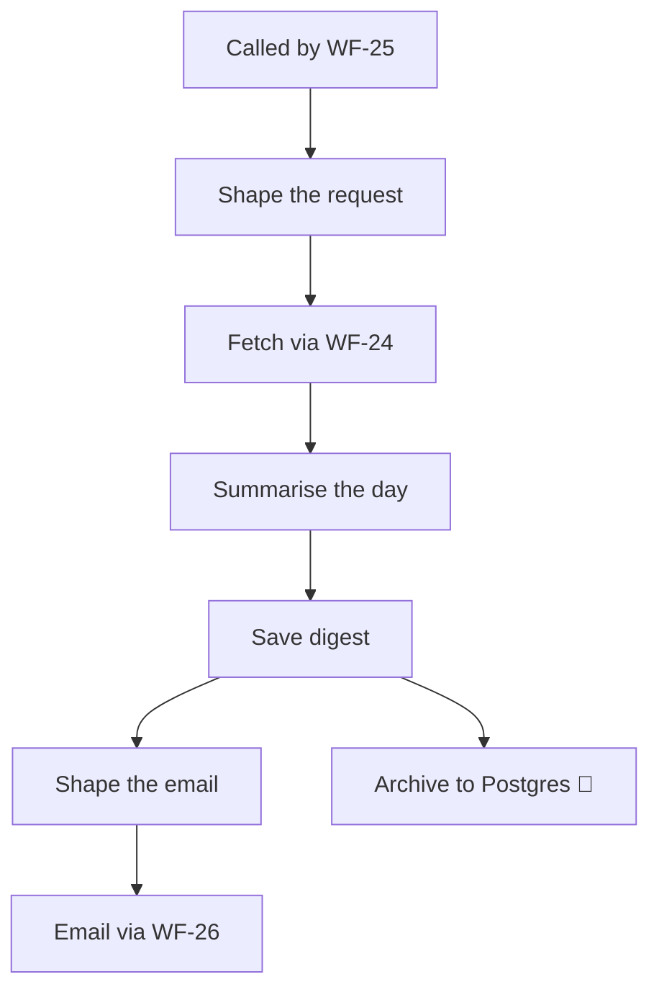

<!-- GENERATED by grace_platform.docs.gen_workflows — DO NOT EDIT.
     Source of truth: platform/n8n/workflows/*.json
     Regenerate with: make docs -->

# WF-20 Daily Call Digest

**Status:** **Live and running.** Invoked every morning by WF-25 and fetches through WF-24 against Vapi's call API. No Core API needed.
**Source:** `platform/n8n/workflows/WF-20-daily-call-digest.json`
**Error handler:** `__WF__:wf-00`
**Calls:** WF-24, WF-26
**Called by:** WF-25

## What it does, and when it runs

The morning summary of yesterday: how many calls, how many became bookings, how many needed a person, and the containment rate — the headline number for an AI receptionist. A day with no calls still records an explicit zero, because a missing report and a quiet day look identical otherwise and need opposite responses.

## Flow

## Nodes, in order

| # | Node | Kind | What it does | Credential |
|---|---|---|---|---|
| 1 | **Called by WF-25** | Called by another workflow | Entry point when another workflow calls this one (`passthrough`). | — |
| 2 | **Shape the request** | Code | The only lines that differ between reports: the fetch window and page size. | — |
| 3 | **Fetch via WF-24** | Calls another workflow | Invokes workflow `__WF__:wf-24`. | — |
| 4 | **Summarise the day** | Code | Aggregate a day of normalised calls (fetched via WF-24) into one row. | — |
| 5 | **Save digest** | Data Table | Writes a row to the `call_metrics` data table, 7 columns. | — |
| 6 | **Shape the email** | Code | Shape the email sent via WF-26 — one line per figure already computed above. | — |
| 7 | **Email via WF-26** | Calls another workflow | Invokes workflow `__WF__:wf-26`. | — |
| 8 | **Archive to Postgres** *(disabled)* | Postgres | Writes a permanent record to Postgres. | `__CRED__:postgres` |

## Where to see it

n8n → **Workflows** → `[dev] WF-20 Daily Call Digest` (`p6dyf5QO26ZtApgG`).
Tagged `managed:git` and `env:dev`, which is how the deploy script knows it owns it — anything
untagged is invisible to it.

Runs appear under **Executions**.
