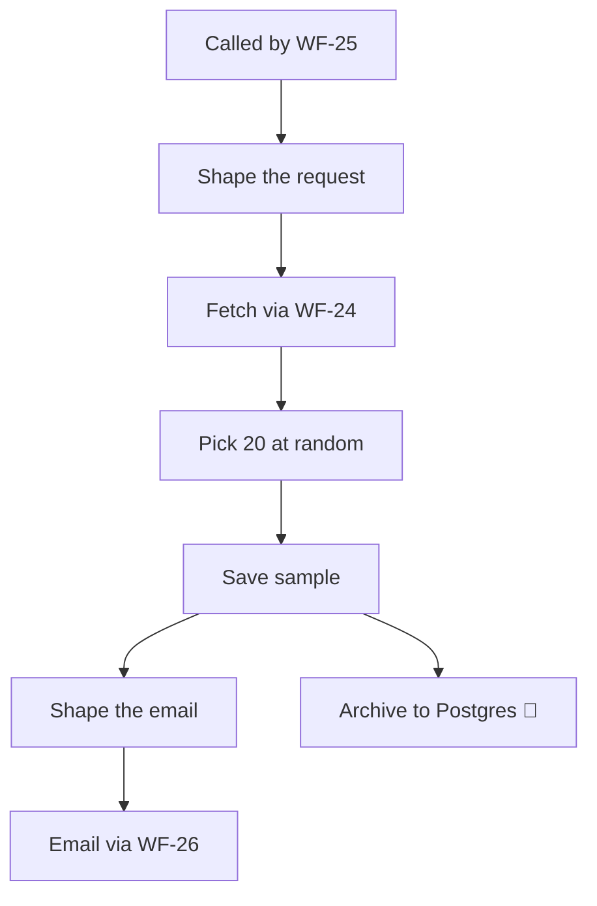

<!-- GENERATED by grace_platform.docs.gen_workflows — DO NOT EDIT.
     Source of truth: platform/n8n/workflows/*.json
     Regenerate with: make docs -->

# WF-21 Weekly QA Sampler

**Status:** **Live and running.** Invoked by WF-25 on Monday mornings; fetches through WF-24.
**Source:** `platform/n8n/workflows/WF-21-weekly-qa-sampler.json`
**Error handler:** `__WF__:wf-00`
**Calls:** WF-24, WF-26
**Called by:** WF-25

## What it does, and when it runs

Picks 20 calls at random each week for a human to listen to. Random rather than worst-first on purpose: sampling ordinary calls is what catches slow drift in how Grace behaves, which reviewing only the failures never will. It stores links into Vapi rather than copies of recordings, so no second copy of sensitive audio is created.

## Flow

## Nodes, in order

| # | Node | Kind | What it does | Credential |
|---|---|---|---|---|
| 1 | **Called by WF-25** | Called by another workflow | Entry point when another workflow calls this one (`passthrough`). | — |
| 2 | **Shape the request** | Code | The only lines that differ between reports: the fetch window and page size. | — |
| 3 | **Fetch via WF-24** | Calls another workflow | Invokes workflow `__WF__:wf-24`. | — |
| 4 | **Pick 20 at random** | Code | Pick 20 calls at random for a human to listen to. Random, not "worst first" — | — |
| 5 | **Save sample** | Data Table | Writes a row to the `call_samples` data table, 9 columns. | — |
| 6 | **Shape the email** | Code | Aggregate every sampled call (Save sample ran once per row) into one email. | — |
| 7 | **Email via WF-26** | Calls another workflow | Invokes workflow `__WF__:wf-26`. | — |
| 8 | **Archive to Postgres** *(disabled)* | Postgres | Writes a permanent record to Postgres. | `__CRED__:postgres` |

## Where to see it

n8n → **Workflows** → `[dev] WF-21 Weekly QA Sampler` (`aqt18Lr8Y7pjBfcC`).
Tagged `managed:git` and `env:dev`, which is how the deploy script knows it owns it — anything
untagged is invisible to it.

Runs appear under **Executions**.
