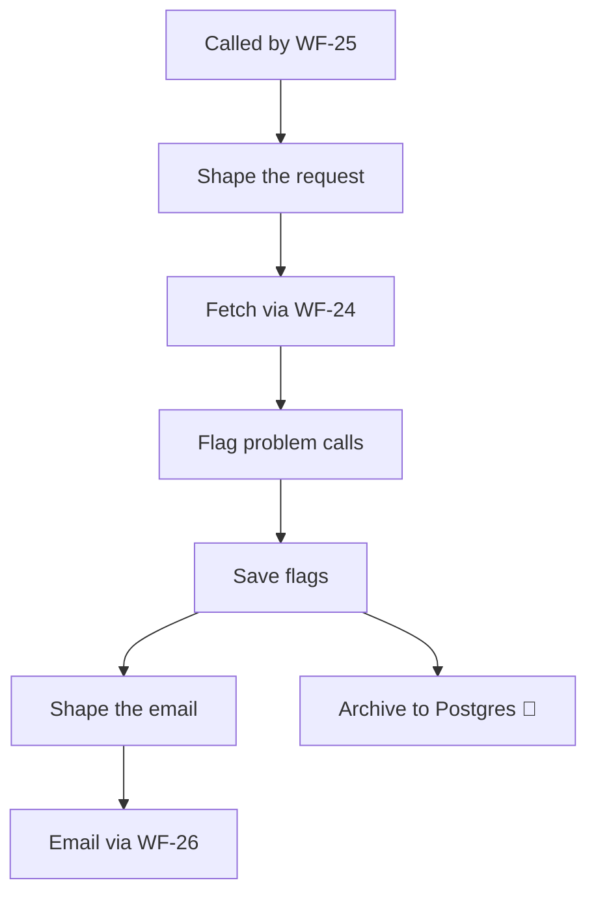

<!-- GENERATED by grace_platform.docs.gen_workflows — DO NOT EDIT.
     Source of truth: platform/n8n/workflows/*.json
     Regenerate with: make docs -->

# WF-22 Call Quality Alert

**Status:** **Live and running.** Invoked hourly by WF-25; fetches through WF-24. Six successful executions on 2026-08-04. Note that an empty run is the normal outcome — it only writes a row when a call trips a signal.
**Source:** `platform/n8n/workflows/WF-22-call-quality-alert.json`
**Error handler:** `__WF__:wf-00`
**Calls:** WF-24, WF-26
**Called by:** WF-25

## What it does, and when it runs

Watches for calls that went wrong — ones that errored, ended in under 15 seconds, or got handed to a person. Those three signals each mean something different, and together they are the earliest warning that something has broken. It writes nothing at all on a clean hour: an empty run is the good outcome here.

## Flow

## Nodes, in order

| # | Node | Kind | What it does | Credential |
|---|---|---|---|---|
| 1 | **Called by WF-25** | Called by another workflow | Entry point when another workflow calls this one (`passthrough`). | — |
| 2 | **Shape the request** | Code | The only lines that differ between reports: the fetch window and page size. | — |
| 3 | **Fetch via WF-24** | Calls another workflow | Invokes workflow `__WF__:wf-24`. | — |
| 4 | **Flag problem calls** | Code | Flag calls worth a human look. Three signals, each meaning something different: | — |
| 5 | **Save flags** | Data Table | Writes a row to the `call_flags` data table, 5 columns. | — |
| 6 | **Shape the email** | Code | Aggregate every flagged call (Save flags ran once per row) into one email. | — |
| 7 | **Email via WF-26** | Calls another workflow | Invokes workflow `__WF__:wf-26`. | — |
| 8 | **Archive to Postgres** *(disabled)* | Postgres | Writes a permanent record to Postgres. | `__CRED__:postgres` |

## Where to see it

n8n → **Workflows** → `[dev] WF-22 Call Quality Alert` (`45tFStlOPZ7yMizO`).
Tagged `managed:git` and `env:dev`, which is how the deploy script knows it owns it — anything
untagged is invisible to it.

Runs appear under **Executions**.
