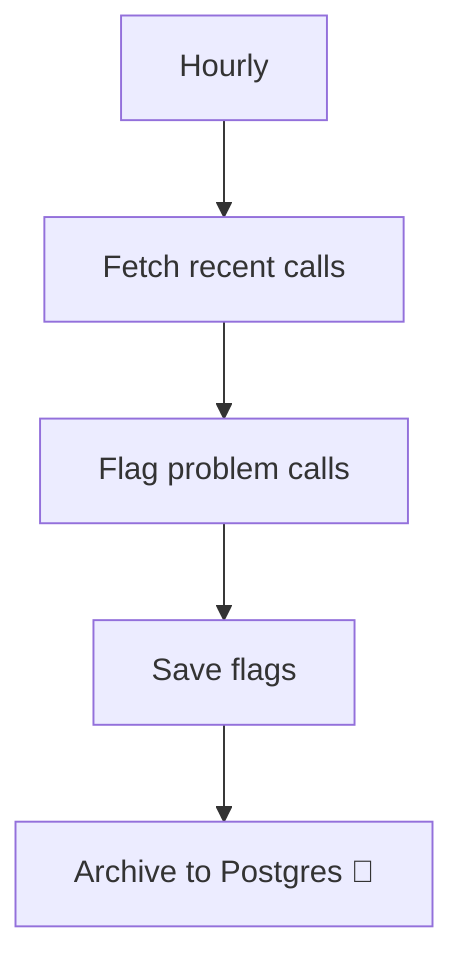

<!-- GENERATED by grace_platform.docs.gen_workflows — DO NOT EDIT.
     Source of truth: platform/n8n/workflows/*.json
     Regenerate with: make docs -->

# WF-22 Call Quality Alert

**Status:** **Active.** Runs hourly against Vapi's call API. Works today.
**Source:** `platform/n8n/workflows/WF-22-call-quality-alert.json`
**Error handler:** `__WF__:wf-00`

## Flow

## Nodes, in order

| # | Node | Kind | What it does | Credential |
|---|---|---|---|---|
| 1 | **Hourly** | Schedule trigger | Runs on a schedule (no timezone set). `{"interval": [{"field": "hours", "hoursInterval": 1, "triggerAtMinute": 7}]}` | — |
| 2 | **Fetch recent calls** | HTTP request | `GET` to `https://api.vapi.ai/call`, timeout 30000 ms. | `__CRED__:vapi` |
| 3 | **Flag problem calls** | Code | Flag calls worth a human look. Three signals, each meaning something different: | — |
| 4 | **Save flags** | Data Table | Writes a row to the `?` data table. | — |
| 5 | **Archive to Postgres** *(disabled)* | Postgres | Writes a permanent record to Postgres. | `__CRED__:postgres` |

## Where to see it

n8n → **Workflows** → `[dev] WF-22 Call Quality Alert`.
Tagged `managed:git` and `env:dev`, which is how the deploy script knows it owns it — anything
untagged is invisible to it.

Runs appear under **Executions**.
