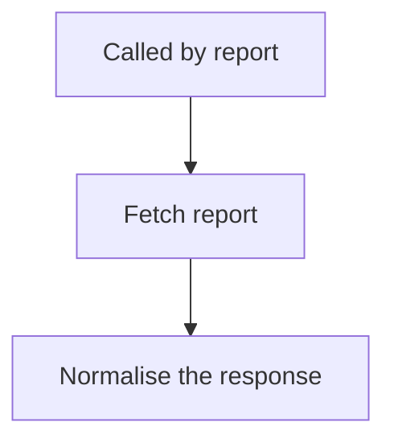

<!-- GENERATED by grace_platform.docs.gen_workflows — DO NOT EDIT.
     Source of truth: platform/n8n/workflows/*.json
     Regenerate with: make docs -->

# WF-23 Core API Report Fetch

**Status:** **Library workflow.** Called by WF-07 and WF-11 to fetch a Core API report; no independent trigger.
**Source:** `platform/n8n/workflows/WF-23-core-api-report-fetch.json`
**Error handler:** `__WF__:wf-00`
**Called by:** WF-07, WF-11

## What it does, and when it runs

Fetches a report from Core API on behalf of whichever workflow asked, and hands back a single predictable answer. It exists so that the awkward part — deciding what a missing or failed service means — is written once instead of copied into every report. Core API does not exist yet, so today it reliably reports that fact rather than crashing.

## Flow

## Nodes, in order

| # | Node | Kind | What it does | Credential |
|---|---|---|---|---|
| 1 | **Called by report** | Called by another workflow | Entry point when another workflow calls this one (`passthrough`). | — |
| 2 | **Fetch report** | HTTP request | `GET` to `__URL__:core-api{{ $json.path }}`, timeout 30000 ms. | `__CRED__:core-api` |
| 3 | **Normalise the response** | Code | Library workflow: fetch a Core API report and normalise the outcome, written once. | — |

## Where to see it

n8n → **Workflows** → `[dev] WF-23 Core API Report Fetch` (`R83ajpEc5kBPOkW8`).
Tagged `managed:git` and `env:dev`, which is how the deploy script knows it owns it — anything
untagged is invisible to it.

Runs appear under **Executions**.
