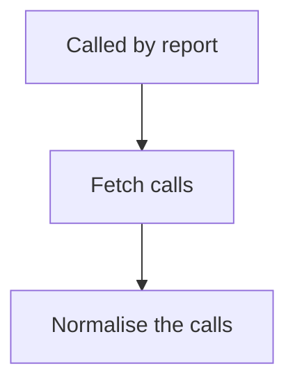

<!-- GENERATED by grace_platform.docs.gen_workflows — DO NOT EDIT.
     Source of truth: platform/n8n/workflows/*.json
     Regenerate with: make docs -->

# WF-24 Vapi Call Fetch

**Status:** **Library workflow.** Called by WF-20/21/22 to fetch and normalise Vapi call records; no independent trigger.
**Source:** `platform/n8n/workflows/WF-24-vapi-call-fetch.json`
**Error handler:** `__WF__:wf-00`
**Called by:** WF-20, WF-21, WF-22

## What it does, and when it runs

Fetches call records from Vapi for a given time window and reduces each one to the handful of fields the reports actually use. Written once and shared, so the three call reports cannot drift apart in how they read a call. It returns everything as a single bundle rather than one item per call, which is what lets a quiet window still produce a report saying so.

## Flow

## Nodes, in order

| # | Node | Kind | What it does | Credential |
|---|---|---|---|---|
| 1 | **Called by report** | Called by another workflow | Entry point when another workflow calls this one (`passthrough`). | — |
| 2 | **Fetch calls** | HTTP request | `GET` to `https://api.vapi.ai/call`, timeout 30000 ms. | `__CRED__:vapi` |
| 3 | **Normalise the calls** | Code | Library workflow: fetch Vapi call records and extract the fields every report | — |

## Where to see it

n8n → **Workflows** → `[dev] WF-24 Vapi Call Fetch` (`4wKh5fUagueLVmRH`).
Tagged `managed:git` and `env:dev`, which is how the deploy script knows it owns it — anything
untagged is invisible to it.

Runs appear under **Executions**.
