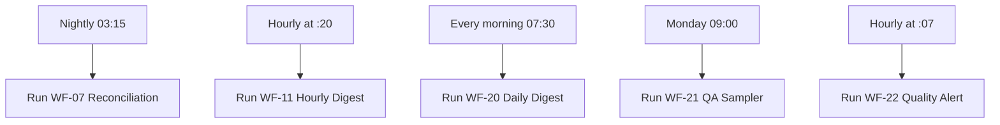

<!-- GENERATED by grace_platform.docs.gen_workflows — DO NOT EDIT.
     Source of truth: platform/n8n/workflows/*.json
     Regenerate with: make docs -->

# WF-25 Reporting Orchestrator

**Status:** **The reporting switch.** Owns all five report schedules; deactivating it stops every report while the heartbeat keeps running.
**Source:** `platform/n8n/workflows/WF-25-reporting-orchestrator.json`
**Error handler:** `__WF__:wf-00`
**Calls:** WF-07, WF-11, WF-20, WF-21, WF-22

## What it does, and when it runs

The single on/off switch for all reporting. It owns every report schedule and calls each report in turn; the reports themselves have no timers any more, so they cannot run behind its back. Switching this one workflow off stops all five reports at once and leaves everything else — the heartbeat, the error handler, the escalation path — untouched.

## Flow

## Nodes, in order

| # | Node | Kind | What it does | Credential |
|---|---|---|---|---|
| 1 | **Nightly 03:15** | Schedule trigger | Runs on a schedule (America/Chicago). `{"interval": [{"field": "days", "triggerAtHour": 3, "triggerAtMinute": 15}]}` | — |
| 2 | **Run WF-07 Reconciliation** | Calls another workflow | Invokes workflow `__WF__:wf-07`. | — |
| 3 | **Hourly at :20** | Schedule trigger | Runs on a schedule (America/Chicago). `{"interval": [{"field": "hours", "hoursInterval": 1, "triggerAtMinute": 20}]}` | — |
| 4 | **Run WF-11 Hourly Digest** | Calls another workflow | Invokes workflow `__WF__:wf-11`. | — |
| 5 | **Every morning 07:30** | Schedule trigger | Runs on a schedule (America/Chicago). `{"interval": [{"field": "days", "triggerAtHour": 7, "triggerAtMinute": 30}]}` | — |
| 6 | **Run WF-20 Daily Digest** | Calls another workflow | Invokes workflow `__WF__:wf-20`. | — |
| 7 | **Monday 09:00** | Schedule trigger | Runs on a schedule (America/Chicago). `{"interval": [{"field": "weeks", "triggerAtDay": [1], "triggerAtHour": 9, "trigg` | — |
| 8 | **Run WF-21 QA Sampler** | Calls another workflow | Invokes workflow `__WF__:wf-21`. | — |
| 9 | **Hourly at :07** | Schedule trigger | Runs on a schedule (America/Chicago). `{"interval": [{"field": "hours", "hoursInterval": 1, "triggerAtMinute": 7}]}` | — |
| 10 | **Run WF-22 Quality Alert** | Calls another workflow | Invokes workflow `__WF__:wf-22`. | — |

## Where to see it

n8n → **Workflows** → `[dev] WF-25 Reporting Orchestrator` (`2RQYvTa95jSt3Qeh`).
Tagged `managed:git` and `env:dev`, which is how the deploy script knows it owns it — anything
untagged is invisible to it.

Runs appear under **Executions**.
