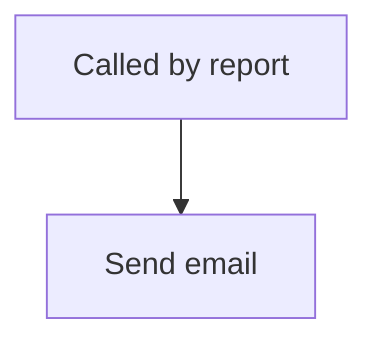

<!-- GENERATED by grace_platform.docs.gen_workflows — DO NOT EDIT.
     Source of truth: platform/n8n/workflows/*.json
     Regenerate with: make docs -->

# WF-26 Send Report Email

**Status:** **Built, waiting on configuration.** Skipped by the deploy until the `smtp` credential exists and `GRACE_REPORTS_EMAIL_TO` is set — its four callers are skipped with it, since they cannot resolve a workflow that was never created.
**Source:** `platform/n8n/workflows/WF-26-send-report-email.json`
**Error handler:** `__WF__:wf-00`
**Called by:** WF-07, WF-20, WF-21, WF-22

## What it does, and when it runs

Sends a finished report out by email. Each report shapes its own subject and body and hands them here, so the mail account, the sending address and the recipient are configured in exactly one place. The hourly digest deliberately does not use it — an email every hour is noise, and noise is how real alerts get ignored.

## Flow

## Nodes, in order

| # | Node | Kind | What it does | Credential |
|---|---|---|---|---|
| 1 | **Called by report** | Called by another workflow | Entry point when another workflow calls this one (`passthrough`). | — |
| 2 | **Send email** | n8n-nodes-base.emailSend | — | `__CRED__:smtp` |

## Where to see it

n8n → **Workflows** → `[dev] WF-26 Send Report Email`.
Tagged `managed:git` and `env:dev`, which is how the deploy script knows it owns it — anything
untagged is invisible to it.

Runs appear under **Executions**.
